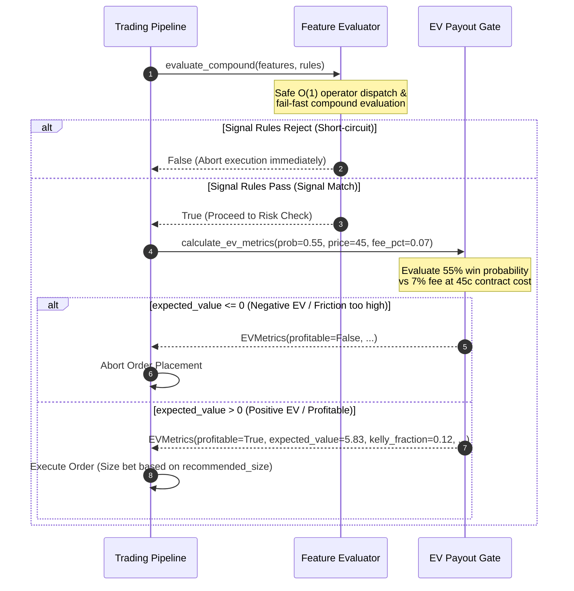

<div align="center">
  <h1>Edge Mining Framework</h1>
  <p><strong>Agnostic Signal Feature Evaluator and EV Payout Gating Engine</strong></p>
  <p>
    <a href="https://github.com/nick/edge-mining-framework/actions"></a>
    <a href="https://codecov.io/gh/nick/edge-mining-framework"></a>
    <a href="https://pypi.org/project/edge-mining-framework"></a>
    <a href="https://github.com/nick/edge-mining-framework/blob/main/LICENSE"></a>
  </p>
</div>

---

The **Edge Mining Framework** is a lightweight, low-latency, mathematical engine designed for prediction market alpha pipelines. It enables algorithmic traders and quant researchers to decouple data ingestion from execution logic. By running live features against compound logical filters and evaluating profitability under friction constraints, the framework strictly gates deployment to maximize Expected Value (EV).

Unlike generic backtesting frameworks, the Edge Mining Framework is built from the ground up to support prediction market contract types (such as binary contracts trading in the $[0, 100]$ cents interval) and natively handles transaction costs, exchange fee structures, and Kelly criterion-based capital allocation.

---

## Table of Contents

- [Architecture & Execution Flow](#architecture--execution-flow)
- [Key Features](#key-features)
- [Mathematical Model](#mathematical-model)
  - [Expected Value (EV) Formulation](#expected-value-ev-formulation)
  - [Kelly Criterion & Position Sizing](#kelly-criterion--position-sizing)
- [Installation](#installation)
- [Quickstart Guide](#quickstart-guide)
  - [1. Scalar Gating](#1-scalar-gating)
  - [2. NumPy-Powered Series Logic](#2-numpy-powered-series-logic)
  - [3. EV Gate & Kelly Capital Allocation](#3-ev-gate--kelly-capital-allocation)
- [API Reference](#api-reference)
  - [`FeatureEvaluator`](#featureevaluator)
  - [`ExpectedValueGate`](#expectedvaluegate)
  - [`EVMetrics`](#evmetrics)
- [Anti-Lookahead Safeguard Contract](#anti-lookahead-safeguard-contract)
- [Development and Testing](#development-and-testing)
- [Contributing](#contributing)
- [License](#license)

---

## Architecture & Execution Flow

The framework operates at the execution boundary of your pipeline. The `FeatureEvaluator` first analyzes raw features against static rules. If all rules are satisfied, the output is routed into the `ExpectedValueGate` for financial validation.



---

## Key Features

1. **Product Definition (Agnostic Design)**: The codebase is fully decoupled from exchange-specific SDKs (e.g., Kalshi, Polymarket) or market API wrappers. It processes raw dictionary inputs and performs pure-math evaluations, making it highly portable.
2. **O(1) Safe Operator Routing**: Implements dynamic function dispatch using Python's native `operator` module (such as `operator.gt`, `operator.eq`). It avoids slow and highly insecure `eval()` or `exec()` invocations.
3. **Fail-Fast Short-Circuiting**: Compound rules are evaluated in-order. The engine returns `False` immediately upon the first failed condition, preventing unnecessary computations on remaining features or time-series.
4. **NumPy-Optimized Series Operators**: Supports sliding-window calculations (`crosses_above`, `crosses_below`, `zscore`, `rolling_corr`, and `rank`) natively in NumPy, executing with $O(n)$ efficiency.
5. **Fee-Aware Expected Value Gating**: Accurately computes EV under prediction market fee models, including maximum fee caps (e.g., capping fee at a fixed percentage of total payout).
6. **Kelly Criterion Position Sizing**: Automatically sizes proposed orders against your live bankroll using the Kelly fraction, protecting your account from risk of ruin.

---

## Mathematical Model

### Expected Value (EV) Formulation

Prediction market contracts payout a fixed amount on completion (typically $100$ cents or $\$1.00$ per contract). The contract purchase price represents the risk capital.

Let:
- $C$ = current contract price in cents ($0 \le C \le Payout$)
- $P_{\text{win}}$ = model's predicted win probability ($0.0 \le P_{\text{win}} \le 1.0$)
- $Y$ = contract payout in cents (default is $100$)
- $F_{\text{pct}}$ = exchange fee percentage (default is $0.07$ for a $7\%$ fee structure)

The mathematical steps calculated in [ExpectedValueGate.calculate_ev_metrics](file:///home/nick/edge-mining-framework/src/edge_mining_framework/gate.py#L78-L161) are:

$$\text{Gross Profit} = Y - C$$

$$\text{Max Fee} = F_{\text{pct}} \times Y$$

$$\text{Effective Fee} = \min(\text{Gross Profit} \times F_{\text{pct}}, \text{Max Fee})$$

$$\text{Net Profit If Win } (b) = \text{Gross Profit} - \text{Effective Fee}$$

$$\text{Loss If Lose } (a) = C$$

The Expected Value (in cents per contract) is then:

$$EV = (P_{\text{win}} \times b) - ((1.0 - P_{\text{win}}) \times a)$$

### Kelly Criterion & Position Sizing

For binary outcomes with a positive expected value, the optimal leverage is computed via the Kelly Criterion:

$$f^* = \frac{EV}{\text{Net Profit If Win } (b)} = \frac{P_{\text{win}} \times b - (1 - P_{\text{win}}) \times a}{b}$$

The Kelly fraction ($f^*$) is strictly clamped:
- Clamped to $[0.0, 1.0]$ for long-only portfolios.
- Clamped to $0.0$ if the expected value is negative ($EV \le 0$).

Given a bankroll $B$, the recommended order size is:

$$\text{Recommended Size} = f^* \times B$$

---

## Installation

The Edge Mining Framework requires Python **3.10** or higher.

### From PyPI (Production)
```bash
pip install edge-mining-framework
```

### From Source (Development)
```bash
git clone https://github.com/nick/edge-mining-framework.git
cd edge-mining-framework
pip install -e .
```

---

## Quickstart Guide

### 1. Scalar Gating

Evaluate scalar thresholds safely and instantly without dynamic code injection:

```python
from edge_mining_framework import FeatureEvaluator

# Live features extracted from the orderbook
features = {
    "rsi_14": 28.5,
    "is_bid_skewed": True,
    "spread_cents": 2.5
}

# Define your alpha trigger rules
rules = [
    {"feature": "rsi_14", "operator": "<", "threshold": 30.0},
    {"feature": "is_bid_skewed", "operator": "==", "threshold": True},
    {"feature": "spread_cents", "operator": "in_range", "threshold": [1.0, 3.0]}
]

# Quick check returns True/False
signal_triggered = FeatureEvaluator.evaluate_compound(features, rules)
print(f"Signal active: {signal_triggered}")
```

### 2. NumPy-Powered Series Logic

Perform complex sliding-window checks. You can feed series inline or namespace them under the `"series"` sub-dictionary:

```python
from edge_mining_framework import FeatureEvaluator

features = {
    "series": {
        "price_history": [10.2, 10.5, 10.1, 10.9, 11.2],
        "volume_history": [1200, 1350, 1100, 1500, 2100]
    }
}

# Trigger on a crossover or z-score outlier
rules = [
    {"feature": "price_history", "operator": "crosses_above", "threshold": 11.0},
    {"feature": "volume_history", "operator": "zscore", "threshold": 1.5}
]

if FeatureEvaluator.evaluate_compound(features, rules):
    print("Time-series signal condition met!")
```

### 3. EV Gate & Kelly Capital Allocation

Route your signal trigger into risk management using [ExpectedValueGate.calculate_ev_metrics](file:///home/nick/edge-mining-framework/src/edge_mining_framework/gate.py#L78-L161):

```python
from edge_mining_framework import ExpectedValueGate

# Context: Predicted probability of win = 55%, current contract price = 45 cents,
# fee = 7%, account bankroll = $50,000 (represented in cents)
bankroll_cents = 5000000 

metrics = ExpectedValueGate.calculate_ev_metrics(
    predicted_win_prob=0.55,
    current_contract_price_cents=45,
    payout_cents=100,
    exchange_fee_pct=0.07,
    bankroll=bankroll_cents
)

print(f"Profitable: {metrics.profitable}")
print(f"Expected Value per contract: {metrics.expected_value:.2f} cents")
print(f"Kelly Fraction: {metrics.kelly_fraction * 100:.2f}%")
print(f"Recommended Allocation: ${metrics.recommended_size / 100:.2f}")
```

---

## API Reference

### `FeatureEvaluator`

Static helper class executing short-circuit evaluations on dictionaries.

#### `evaluate_compound(features: Dict[str, Any], rule_config: List[Dict[str, Any]]) -> bool`
Evaluates multiple rules. Returns `False` immediately on the first failed rule or missing feature/series.
- **`features`**: The feature dictionary. To reference series, map keys directly to lists or nest them inside `features["series"]`.
- **`rule_config`**: A list of rule dictionaries containing `"feature"`, `"operator"`, and `"threshold"` keys.

#### Supported Operators
| Operator | Type | Description |
| :--- | :--- | :--- |
| `==`, `!=`, `<`, `>`, `<=`, `>=` | Scalar | Checks scalar relations using standard Python operations. |
| `in_range` | Scalar | Returns `True` if value is within `[min, max]` (inclusive). |
| `in_set` | Scalar | Returns `True` if value is present in the threshold iterable. |
| `crosses_above` | Series | Returns `True` if `series[-2] <= threshold < series[-1]`. |
| `crosses_below` | Series | Returns `True` if `series[-2] >= threshold > series[-1]`. |
| `zscore` | Series | Returns `True` if the absolute z-score of the last value is $\ge$ threshold. |
| `rolling_corr` | Series | Returns `True` if the absolute correlation between two series over `window` is $\ge$ threshold. Requires a threshold dictionary like `{"other": "series_b", "window": 10, "min_corr": 0.7}`. |
| `rank` | Series | Returns `True` if the average percentile rank (from $0$ to $1$) of the last value is $\ge$ threshold. |

---

### `ExpectedValueGate`

Risk gating engine calculating expected returns and position sizing.

#### `calculate_ev_metrics(predicted_win_prob: float, current_contract_price_cents: float, payout_cents: float = 100.0, exchange_fee_pct: float = 0.07, bankroll: float = 1.0) -> EVMetrics`
Performs continuous expected value calculations, accounting for exchange fee caps.
- **`predicted_win_prob`**: Estimated win probability ($0.0$ to $1.0$).
- **`current_contract_price_cents`**: Contract price ($0.0$ to `payout_cents`).
- **`payout_cents`**: Contract terminal value (default $100.0$).
- **`exchange_fee_pct`**: Exchange fee rate as a decimal (default $0.07$ = $7\%$).
- **`bankroll`**: Account sizing base. Pass your portfolio size to calculate recommended size.

#### `is_profitable_after_fees(predicted_win_prob: float, current_contract_price_cents: int, payout_cents: int = 100, exchange_fee_pct: float = 0.07, minimum_ev_cents: float = 1.0) -> bool`
Backward-compatible wrapper checking if the trade expected value is $\ge$ `minimum_ev_cents`.

---

### `EVMetrics`

A frozen dataclass representing risk metrics:
- **`expected_value`** (`float`): Expected profit/loss in cents per contract.
- **`kelly_fraction`** (`float`): Recommended portfolio fraction ($0.0$ to $1.0$).
- **`recommended_size`** (`float`): Sizing suggestion in bankroll units (`kelly_fraction * bankroll`).
- **`profitable`** (`bool`): Direct flag indicating if expected value is strictly positive.

---

## Anti-Lookahead Safeguard Contract

Data leakage is the most common pitfall in algorithmic trading. The Edge Mining Framework uses an **Anti-Lookahead contract design**:
- The library does **not** slice series inputs automatically.
- All series calculations (e.g. `crosses_above`, `zscore`, `rank`) are performed relative to the **final index** of the provided sequence (`series[-1]` and `series[-2]`).
- **Developer Contract**: To evaluate signals at timestamp $T$, the caller **must** slice all historical series to only include data points up to $T$ (i.e. `series[:T+1]`). Passing future data points (e.g., $T+1$) will cause leakage.

Refer to the properties defined in [test_anti_lookahead.py](file:///home/nick/edge-mining-framework/tests/test_anti_lookahead.py) for structural verification.

---

## Development and Testing

### Setup Environment
```bash
# Create virtual environment
python3 -m venv .venv
source .venv/bin/activate

# Install dependencies and pre-commit hooks
pip install -r requirements.txt -e .
pre-commit install
```

### Run Test Suite
```bash
# Run pytest directly
pytest

# Run tests with coverage reporting
pytest --cov=edge_mining_framework --cov-report=term-missing
```

---

## Contributing

We welcome contributions to the Edge Mining Framework! Please adhere to the following workflow:
1. Fork the repository and create a feature branch (`feature/your-cool-idea`).
2. Write clean code adhering to Python's typing system and docstring specifications.
3. Ensure coverage does not decrease (run `pytest --cov`).
4. Format changes using `black`, `isort`, and `ruff` lint tools.
5. Open a Pull Request detailing the performance impact or feature additions.

---

## License

This project is licensed under the MIT License. See [LICENSE](file:///home/nick/edge-mining-framework/LICENSE) for more information.
