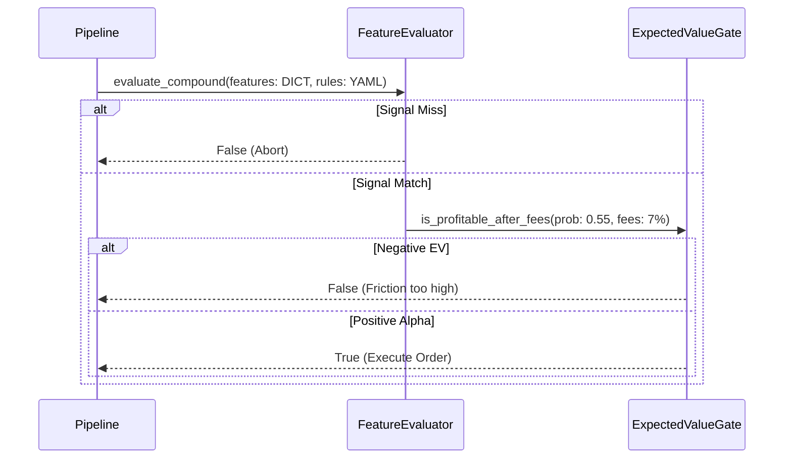

  <h1>Edge Mining Framework</h1>
  
<strong>Agnostic Signal Feature Evaluator and EV Payout Gating Engine</strong>

  
  

## Architecture

This repository evaluates live orderbook/alpha features against strict compound thresholds and mathematically blocks deployment unless the Expected Value (EV) exceeds friction parameters.

## Modular Operators

The `FeatureEvaluator` utilizes a dictionary routing technique against Python's base `operator` module, avoiding slow and unsafe `eval()` operations.

Supported O(1) mathematical operators:
`==`, `!=`, `<`, `>`, `<=`, `>=`, `in_range`, `in_set`
